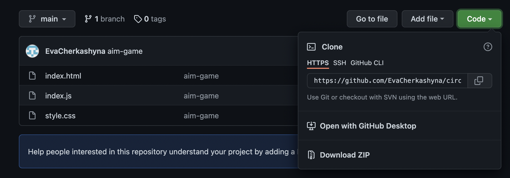

<hr>

# Description
Этот проэкт был создан как список дел, где ты можешь посмотреть выполненые дела, и те которые еще предстоит сделать. Весь проэкт реализирован с помощью **REACT**, по курсу 
 `React + Redux - Профессиональная Разработка UDEMY`.

# Objective
 The goal of creating this project was to look at various elements and practice in JavaScript and React.
+ работа с ___React___  ***элементами*** и ***компонентами***
+ работа с ***JSX***
+ практика использования ***ключей*** и ***коллекций***
+ работа с ***обработкой*** ***событий***
+ работа с ***классами*** и ***фунциями***
+ реализация ***поиска*** с ***нечуствительным*** **регистром**

```JS
addItem = (text) => {
    const newItem = this.createTodoItem(text)
    this.setState(({ todoData }) => {
      const newArr = [...todoData, newItem]
      return {
        todoData: newArr
      }
    })
  }
```
# How to use
если вы хотите добавить дело к вашему листу напишите это в графе What needs to do  и нажмите клавишу `Add`


если вы хотите посмотреть на активные дела, тоесть те что нужно сделать, кликните по кнопке `Active`


если вы хотите посмотреть сделаные дела нажмите кнопу `Done` (Чтоб пометить дело как сделаное, кликните по нем )


если вы хотите найти ваше дело среди кучи других дел, дайте запрос в поле `type to search`(регистр не учитываеться)


# Download instructions

1. Copy the link you can find by clicking on the green `code` button.
2. Write in terminal: `git clone link`.
3. The project will be copied to the selected folder.


